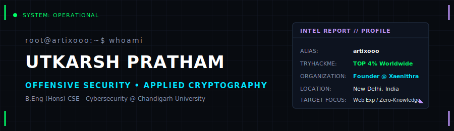

<div align="center">
  
</div>

<br />

<p align="center">
  <a href="mailto:prathamutkarshh@gmail.com"></a>
  <a href="https://utkarsh.xaenithra.com"></a>
  <a href="https://linkedin.com/in/utkarsh-pratham"></a>
  <a href="https://github.com/artixooo"></a>
  <a href="https://tryhackme.com/p/artixooo"></a>
</p>

<br />

```bash
$ ls -la /home/artix/profile/
total 32
drwxr-xr-x  6 artix artix 4096 Jul 18 15:53 .
drwxr-xr-x  3 root  root  4096 Jul 18 15:53 ..
drwxr-xr-x  2 artix artix 4096 Jul 18 15:53 ctf_battlefield/
drwxr-xr-x  2 artix artix 4096 Jul 18 15:53 skills/
drwxr-xr-x  2 artix artix 4096 Jul 18 15:53 experience/
drwxr-xr-x  2 artix artix 4096 Jul 18 15:53 projects/
drwxr-xr-x  2 artix artix 4096 Jul 18 15:53 certifications/
-rw-r--r--  1 artix artix 1024 Jul 18 15:53 readme.txt
```

### 📄 readme.txt
> Cybersecurity undergraduate specializing in offensive security, web exploitation, and applied cryptography. Ranked in the Top 4% globally on TryHackMe and adept at leading competitive teams to top finishes in national and international CTF competitions.

---

### 📂 /home/artix/profile/ctf_battlefield/
```console
[+] TryHackMe Global Ranking: Top 4% Worldwide
[+] CTF Deployments:
    ├── [2026-05] BYUCTF -------------------------- [Rank 15 / 500+ teams]
    ├── [2026-03] Cyberstrike CTF ----------------- [Rank 4 - Secured Critical Infra]
    ├── [2026-03] HackData CTF -------------------- [Rank 5 / 300 - Web/Crypto/Forensics]
    ├── [2026-01] SVNIT Echelon ------------------- [Rank 1 - Absolute Victory]
    ├── [2025-12] IIT Madras CTF ------------------ [Rank 6 / 600+ teams]
    └── [2025-10] CipherHunt CTF ------------------ [Rank 7]
```

---

### 📂 /home/artix/profile/projects/
*Undergraduate deployment & system builds.*

<details>
<summary><b>👁️ TRINETRA: Digital Assembly Line</b> <i>(FastAPI, PyTorch, React, Kotlin, Flutter)</i></summary>
<blockquote>
5-stage digital forensics pipeline for law enforcement featuring Android data extraction, ML threat scoring, sandbox environment, and automated cryptographically signed PDF report generation.
</blockquote>
</details>

<details>
<summary><b>🔗 Xaenithra Encoded: Secure Relay</b> <i>(Go, Kotlin, Libsodium, WebSockets)</i></summary>
<blockquote>
Zero-knowledge encrypted messaging platform supporting secure end-to-end communication with Android client utilizing baked-in binary secrets under a PSSA model, with Go-based "blind router" relay incapable of decrypting messages.
</blockquote>
</details>

<details>
<summary><b>🧠 Leda AI — Companio</b> <i>(React, Node.js, WebSockets, Gemini API)</i></summary>
<blockquote>
Real-time multimodal AI assistant for the elderly leveraging the Google Gemini Multimodal Live API via WebSockets for low-latency voice conversations. Integrated tool-calling for alarms/reminders and real-time audio visualizer.
</blockquote>
</details>

<details>
<summary><b>⚡ Pathfinder</b> <i>(React, TS, Vite, TailwindCSS)</i></summary>
<blockquote>
TikTok-style AI learning roadmap generator featuring a vertical swipe UX and AI-generated roadmaps. Built on custom glassmorphism component libraries (GlassCard, NeonButton, GlitchText).
</blockquote>
</details>

<details>
<summary><b>👁️ Astra: Advanced Surveillance Architecture</b> <i>(Python, Next.js, PyTorch, FastAPI)</i></summary>
<blockquote>
Multimodal deep learning system to detect synthetic media (fake images, manipulated videos, and malicious URLs) utilizing XceptionNet and MTCNN with Grad-CAM explanations.
</blockquote>
</details>

---

### 📂 /home/artix/profile/skills/
<p align="center">
  <a href="https://skillicons.dev">
    
  </a>
</p>

<details>
<summary><b>🔍 View detailed skill breakdown</b></summary>
<br>

- **Cybersecurity & Cryptography**: VAPT, Web App Security, Applied Cryptography (PKI, Symmetric/Asymmetric, zero-knowledge), Digital Forensics & Incident Response, Threat Hunting, OSINT.
- **AI & Machine Learning**: Applied Machine Learning, PyTorch, Large Language Models (LLMs), Generative AI Pipelines, Adversarial ML & Security.
- **Networking & Web Security**: TCP/IP, DNS, HTTP/HTTPS, OWASP Top 10, SQL Injection, Auth Testing, SMB, FTP, SSH.
- **Tools**: Burp Suite, Metasploit, Nmap, Gobuster, SQLMap, Wireshark, tcpdump, Hashcat, John the Ripper, OpenSSL, CyberChef, REMnux, FlareVM.
</details>

---

### 📂 /home/artix/profile/experience/
```console
[+] OPERATION: VAPT Intern @ CyArt [Jun 2026 – Present]
    ├── Conduct VAPT across web applications and network infrastructure (Burp Suite, Metasploit)
    ├── Validate vulnerabilities, exploit misconfigurations, and formulate remediation plans
    └── Draft comprehensive reports detailing exploit chains and risk severity

[+] OPERATION: Founder & Team Lead @ Xaenithra [Nov 2025 – Present]
    ├── Lead competitive cybersecurity team in hackathons and CTF competitions
    ├── Secure top finishes in national/international CTF events against 600+ teams
    └── Design/develop the official team web presence (xaenithra.com) as UI/UX Lead

[+] OPERATION: Core Team Member @ Cysecsphere Club CU [Sep 2025 – Feb 2026]
    └── Orchestrated cybersecurity workshops, enhancing practical knowledge among students
```

---

### 📂 /home/artix/profile/certifications/
<details>
<summary><b>🔍 View 13 Clearances & Credentials</b></summary>
<br>

- **Certified AppSec Practitioner (CAP) v2** (Merit) — *The SecOps Group* (Dec 2025)
- **Google Cybersecurity Professional** — *Google* (Jun 2026)
- **Career Essentials in Cybersecurity** — *Microsoft & LinkedIn* (Jul 2025)
- **Cyber Security 101** — *TryHackMe* (Jul 2026)
- **Pre-Security Certificate** — *TryHackMe* (Jan 2026)
- **CyberPeace First Responders & Myth Busters** — *CyberPeace Corps* (Apr 2026)
- **Deloitte Cyber Job Simulation** — *Forage* (Jul 2026)
- **Mastercard Cybersecurity Job Simulation** — *Forage* (Jul 2026)
- **Tata Cybersecurity Analyst Job Simulation** — *Forage* (Jul 2025)
- **Ethical Hacker** — *Udemy* (Jul 2026)
- **Coding for Everyone: C and C++** — *University of California, Santa Cruz* (Dec 2025)
- **Programming Foundations with JS, HTML, CSS** — *Duke University* (Sep 2025)
- **Generative AI Foundations** — *upGrad* (Jul 2025)
</details>

---

### 📂 /home/artix/profile/education_and_volunteering/
<details>
<summary><b>🔍 View academic background & volunteering logs</b></summary>
<br>

- **B.Eng (Hons.) CSE - Cybersecurity** @ Chandigarh University (Jul 2025 – Aug 2029)
  - Specialization in collaboration with IBM.
- **LaTeX Creator & Community Contributor** @ Brainly (Apr 2020 – Jan 2022)
  - Authored LaTeX-based mathematical visual representations and simplified complex geometry diagrams.
</details>

---

<br />

<div align="center">
  <h3>✦ CYBER RANGE TELEMETRY</h3>
  <br />
  
  &nbsp;&nbsp;
  
</div>
